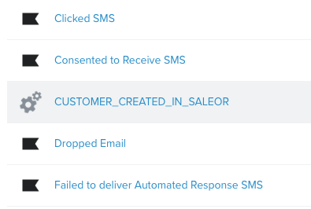

# How to connect your App with Klaviyo

## Installation

Follow [readme](../README.md) and deploy app. Then, install it in your Saleor Dashboard

## Creating Klaviyo account

Before we continue, you need a Klaviyo account. You can sign up [here](https://www.klaviyo.com/).

## Accessing your public key

To access your public key, please follow this [Klaviyo document](https://help.klaviyo.com/hc/en-us/articles/115005062267-How-to-Manage-Your-Account-s-API-Keys).

## Dashboard configuration

1. Open Dashboard and navigate to the "Apps" section.
2. Find your fresh installed Klaviyo app.
3. Paste your public key into the input field and save.

## Triggering the initial webhook

First and foremost, you need to perform an initial API call to Klaviyo, which will create a metric (of which the name you can configure in the Klaviyo App configuration screen).

Let's navigate to "Customers" and create the first, dummy customer.

Then, open Klaviyo [Metrics page](https://www.klaviyo.com/analytics/metrics).

Your Metric should be visible on the list:

## Creating a flow

Now, you can create your first flow

1. Open the [flow creation page](https://www.klaviyo.com/flows/create).
2. Click "Create from scratch" and name your flow.
   
3. Create a new trigger with "Metric".
   
4. Your freshly sent Metric should be available.
   
5. Now you can proceed to create your flow. Feel free to welcome your user.
   
